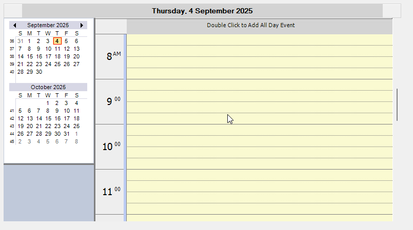

# How to customize the time slot for Day, Custom and Work Week View in WinForms ScheduleControl?

By default, the time division in the [WinForms ScheduleControl](https://www.syncfusion.com/winforms-ui-controls/scheduler) is 30 minutes per hour. However, this can be customized using the [DivisionsPerHour](https://help.syncfusion.com/cr/windowsforms/Syncfusion.Windows.Forms.Schedule.ScheduleAppearance.html#Syncfusion_Windows_Forms_Schedule_ScheduleAppearance_DivisionsPerHour) property. The allowed values for this property are 1, 2, 3, 4, 5, 6, 10, 12, 15, 20, or 30.


```csharp
this.scheduleControl1.Appearance.DivisionsPerHour = 4;
```



Take a moment to peruse the [WinForms ScheduleControl - Customizing Appearance](https://help.syncfusion.com/windowsforms/scheduler/customizing-appearance) documentation, where you can find about customizing appearance properties.